<center> <h1>CSE231: Advanced Compiler Design</h1> </center>
<center> <h2>Assignment 2</h2> </center>
<center> <h3>Xin Du   A59005499</h3> </center>

### 1. Representation of Values
I define a type `Literal` in `ast.ts`.

```Typescript
export type Literal<A> = 
    {a?:A, tag:"num", value: number}
  | {a?:A, tag:"bool", value: boolean}
  | {a?:A, tag:"none"}
```

When parsing a statement `print(a)`, first, this statement is parsed as `{tag: "builtin1", name: "print", arg: Literal<null>}`. Then in the type checking stage, according to the tag of `arg`, the compiler will annotate this statement with a attrbute `a`. After that, in function `codeGenExpr`, the compiler will use the attrbute `a` to determine  which print function to call.

A snnipet of `codeGenExpr` is shown as follows:
```Typescript
if(expr.name=="print"){
    switch(expr.arg.a){
        case(Type.bool): toCall = "print_bool"; break;
        case(Type.int): toCall = "print_num"; break;
        case(Type.none): toCall = "print_none"; break;
    }
}
```

There are three print functions in my implementation(in `webstart.ts`):

```Typescript
print_num: (arg : any) => {
    console.log("Logging from WASM: ", arg);
    display(String(arg));
    return arg;
},

print_bool: (arg : any) => {
    if(arg === 0) { display("False"); }
    else { display("True"); }
    return arg;
},

print_none: (arg: any) => {
    display("None");
    return arg;
}
```
This implementation can print all integers and boolean values correctly. For example:

```Python
x:bool = True
print(x)
```

The generated .wat file is shown as follows:
```wasm
(module
        (func $print_num (import "imports" "print_num") (param i32) (result i32))
        (func $print_none (import "imports" "print_none") (param i32) (result i32))
        (func $print_bool (import "imports" "print_bool") (param i32) (result i32))
        (func $abs (import "imports" "abs") (param i32) (result i32))
        (func $max (import "imports" "max") (param i32 i32) (result i32))
        (func $min (import "imports" "min") (param i32 i32) (result i32))
        (func $pow (import "imports" "pow") (param i32 i32) (result i32))
        
        (global $x (mut i32) (i32.const 0))
        (func (export "_start") (result i32)
          (local $scratch i32 )
          (i32.const 1 )
          (global.set $x)
          (global.get $x)
          (call $print_bool)
          (local.set $scratch)
          (local.get $scratch)
        )
      )
```

We can see that in this script, the compiler calls `print_bool` to print data, which is what we expect.

The result is shown as follows:

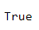

### 2. Variables

The program is shown as follows:
```Python
x:int = 5
def f(x:int)->int:
    y:int = 5
    x = x + 1
    return x+y

print(f(x))
print(x)
```

In this program, `x` in the first line is a global variable. `f` is a function that accepts one `int` argument. `y` is a variable defined inside the function. 

In the parse stage, the above program will be parsed as 4 statements. The first statement is a variable initialization statement, the second statement is a function defination statement, and the last 2 statements are call expressions. They are stored in different array in  type `Program`. `x` is stored in an array called `varinits`, `f` is stored in an array called `fundefs`, and 2 prints are stored in an array called `stmts` .

In the type check stage, the type checker will add annotations to statements, but it will maintain the structure of `Program` object. 

In the gode generation stage, the statements in `varinits` are generated as global variables by `codeGenVarInit`, the statements in `fundefs` are generated as function definations by function `codeGenFunDef`. In function `codeGenFunDef`, we mainly do 3 things:
    1. Set all global variables, local variables and parameters in the function enviorment.
    2. Hoist local variable declarations to the top of function body.
    3. For each sentence that uses variable, first we try to find it in the local scope, if it not exists, then we turn to global scope. 

The `codeGenFunDef` is shown as follows:

```Typescript
function codeGenFunDef(fundef: FunDef<Type>, locals:LocalEnv): Array<string>{
  const withParamsAndVariables = new Map<string, boolean>(locals.entries());
  // Construct the environment for the function body
  const variables = variableNames(fundef.body);  //local variables
  variables.forEach(v=> withParamsAndVariables.set(v, true));
  fundef.params.forEach(p=>withParamsAndVariables.set(p.name, true))

  const params = fundef.params.map(p => `(param $${p.name} i32)`).join(" ");
  const varDecls = variables.map(v => `(local $${v} i32)`).join("\n");
  const stmts:Array<string>[] = []
  fundef.body.map(s=>{stmts.push(codeGenStmt(s, withParamsAndVariables))});
  const flattenstmts = [].concat(...stmts)
  const stmtsBody = flattenstmts.join("\n");
  return [`(func $${fundef.name} ${params} (result i32)
      (local $scratch i32)
      ${varDecls}
      ${stmtsBody}
      (i32.const 0))`];
}
```

For all the statements, always try to find its variables in the local scope, if we can't find it in the local scope, then turn to global scope.

### 3. Infinite Loop
The program is shown as follows:
```Python
x:bool= True

while True:
    print(1)
```

When I run it on the web page, my Chrome Browser crashes. The error message is shown as follows:
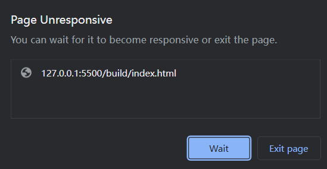

### 4. Examples

1. A program that reports a type error for adding a number and a boolean where one operand is a call expression and the other operand is a variable (for example, f(1) + x)
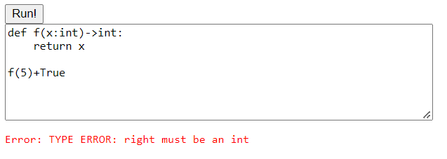

2. A program that has a type error in a conditional position (the condition part of an if or while), where that position is a non-global identifier (function parameter or local variable)
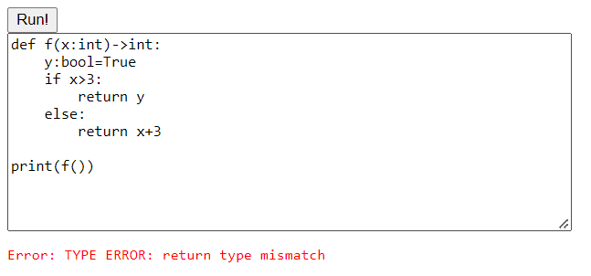

3. A program that with a loop that has multiple iterations, and calls a function on each iteration (it can be the same function)
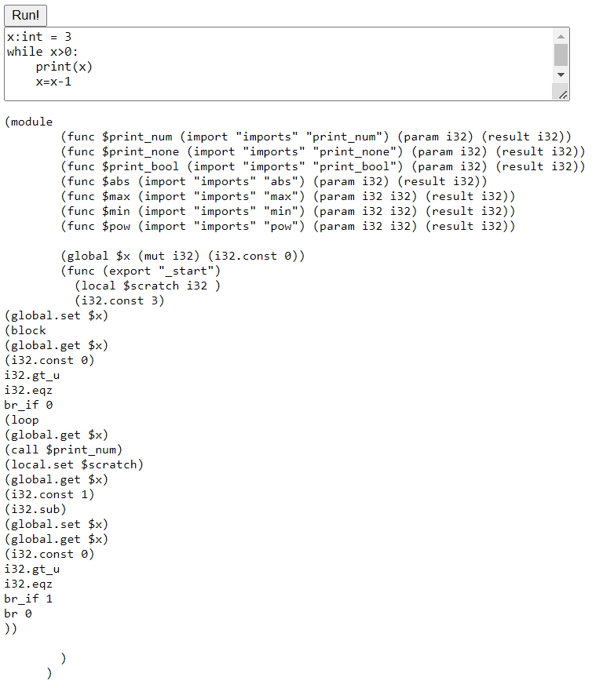
4. A program that returns from the body of a loop, and not on the first iteration of the loop
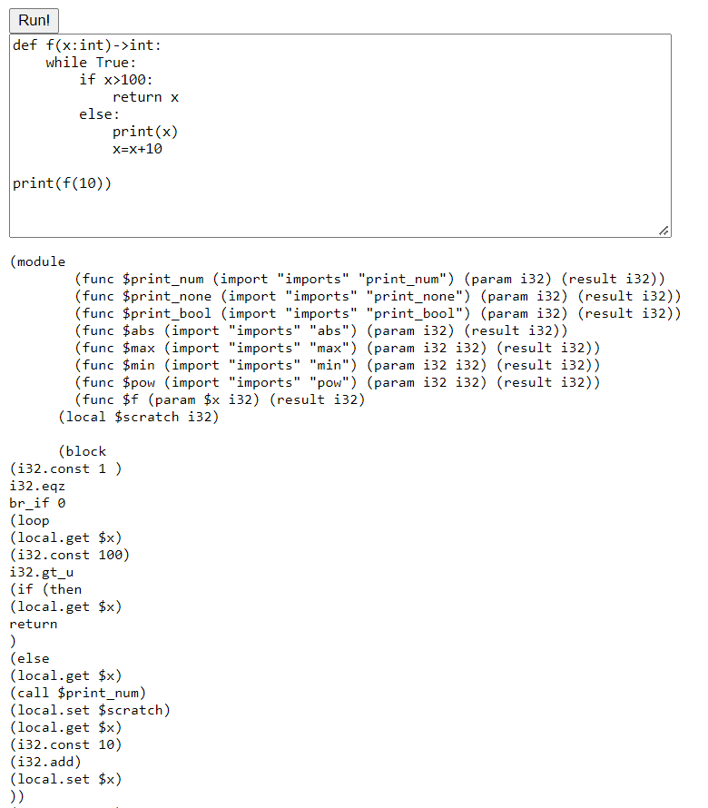

5. Printing an integer and a boolean
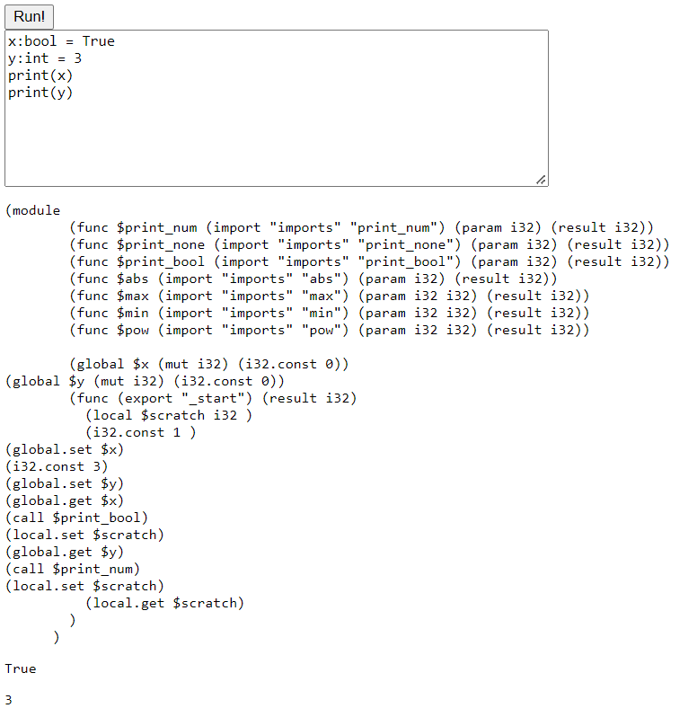
6. A recursive function that terminates (e.g. no stack overflow)
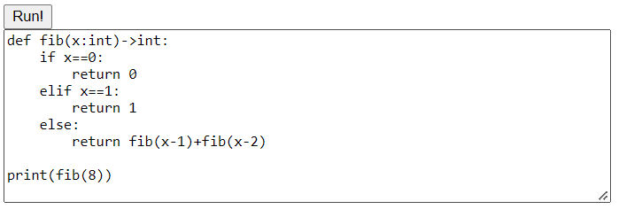

    This is a recursive Fibonacci number generation function.

    The result is shown as follows:
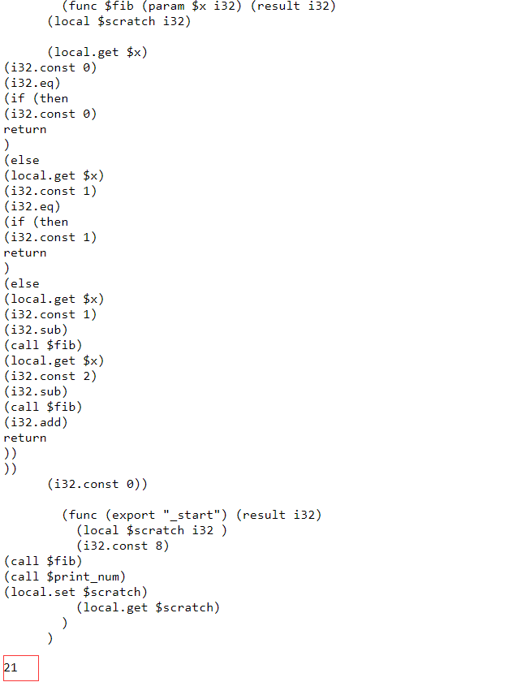

7. Two mutually-recursive functions that terminate (e.g. no stack overflow)
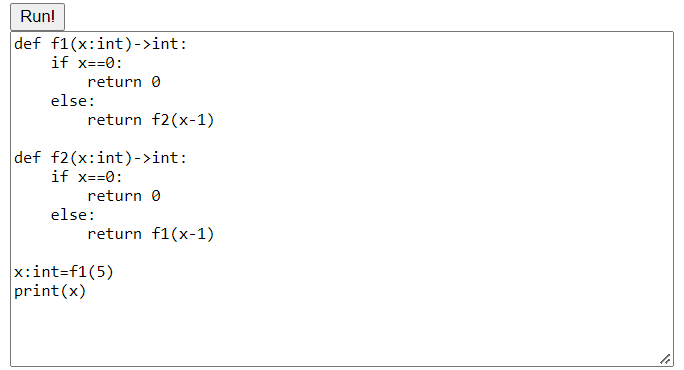
The functions above are meaningless. But they are mutually-recursive functions, and can be excuted correctly. The result is shown as follows:
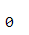


### 5. Analysis - scenario 1
Program

```Python
def f(x:int)->int:
    return x

f(5)+True
```

The relevant code of type checking is shown as follows:
```Typescript
case "binexpr":
            const left = typeCheckExpr(expr.left, env);
            const right = typeCheckExpr(expr.right, env);
            if (left.a!== Type.int){
                throw new Error("TYPE ERROR: left must be an int");
            }
            if (right.a!==Type.int){
                throw new Error("TYPE ERROR: right must be an int");
            }
            return {...expr, a:Type.int, left:left, right:right}
```

The function `typeCheckExpr` is used to return a typed statement. Since `f(5)` is a call, is is annotated with its return value type. Since `True` is a `Literal`, it goes to `typeCheckLiteral`. `typeCheckLiteral` is shown as follows:

```Typescript
export function typeCheckLiteral(literal: Literal<null>): Literal<Type>{
    switch(literal.tag){
        case "num":
            return {...literal, a: Type.int};
        case "bool":
            return {...literal, a: Type.bool};    
        case "none":
            return {...literal, a: Type.none};
    }
}
```

We can see that in the `typeCheckLiteral` function, this `Literal` is annotated with `Type.bool`. Then back to the function `typeCheckExpr`, since `right.a !== Type.int`, the compiler will raise an error `TYPE ERROR: right must be an int`.